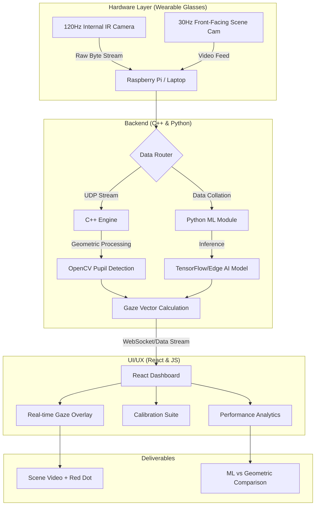

# Eye Tracker project

A high-precision, low-latency eye tracker prototype. Use cases include medical, marketing, sports performance coaching, gaming, day-to-day life, etc.

# (Super) Team: 
Cody Lam, Daniel Kaijzer, Ethan Shim, Harwin He, Roselio Ortega

# Deliverables and milestones 
1. Physical Prototype with basic eye tracking (model-based), processing done on laptop/PC. Data streaming to the terminal. Milestone #1
2. A nice web app to visualize data being streamed in. Milestone #2
3. Run ML model inference on the prototype for improved performance. Milestone #3
4. Mobile eye tracking setup using Raspberry Pi streaming data over WiFi or BLE to a laptop. Milestone #4
5. Finished product with AI inference running on the Raspberry Pi and data streaming to our web app via WiFi. Milestone #5

