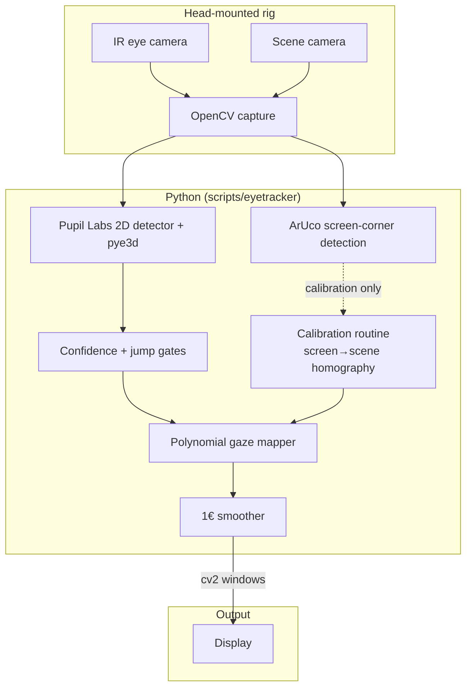

# Eye Tracker

A high-precision, low-latency eye tracker prototype. A head-mounted rig pairs an IR eye camera with a forward-facing scene camera. A Python pipeline detects the pupil, calibrates a polynomial mapping from pupil pixels to scene-camera pixels, and renders the gaze locally (OpenCV).

## Install

**Python** (3.11+ recommended):

```
brew install eigen opencv                       # macOS system deps for pupil-detectors
git clone https://github.com/pupil-labs/pupil-detectors.git ../pupil-detectors
pip install -r requirements.txt                 # installs the local pupil-detectors clone
```

`requirements.txt` references `../pupil-detectors` as a local path; adjust the clone location or edit the path if your layout differs. `pye3d` ships from PyPI.

**Hardware** — head-mounted rig with an IR eye camera and a forward-facing scene camera (USB UVC). Calibration draws four ArUco markers (`DICT_4X4_50`, IDs 0/1/2/3) directly onto the laptop screen.

## Running

```
py -m scripts.eyetracker
```

### In-app controls (eye tracker window)

| Key | Action |
| --- | --- |
| `c` | Quick calibration (4×3 grid, degree-2 polynomial) |
| `d` | Detailed calibration (5×4 grid, degree-3 polynomial, with worst-point recapture) |
| `l` | Load most recent saved calibration |
| `r` | Reset the pye3d 3D pupil model (give it ~30 s to reconverge) |
| `space` | Pause |
| `q` | Quit |

## Repo layout

```
scripts/eyetracker/         # Main Python package — `py -m scripts.eyetracker`
    __main__.py             # Composition root: wires concrete classes into App
    app.py                  # Main loop, frame routing, key dispatch
    config.py               # All tunables (camera, calibration grid, smoother, ArUco)
    cameras/                # OpenCV camera sources + discovery
    pupil/                  # Pupil Labs detector + confidence/jump gates
    scene/                  # ArUco detection and screen→scene homography
    gaze/                   # Polynomial mapper, 1€ smoother
    calibration/            # State machine, sample collector, persistence
    dataset.py              # Load per-session labels into one frame (+ Parquet cache)
    display/                # Tk calibration overlay, cv2 windows

scripts/extras/             # Standalone utilities
    record.py                       # Sync-recorded eye + scene MP4s
    analyze_recordings.py           # Per-file stats on a recording dir
    calibrate_scene_intrinsics.py   # ChArUco intrinsics for the scene camera
    generate_charuco_board.py       # Prints the board PNG used above
    gaze_emulator.py                # Synthetic gaze stream for dashboard dev
    measure_gaze_accuracy.py        # Post-hoc accuracy on a labeled session
    heatmap.py, camera_test.py, linux_cam_stream.py

experimental/               # Paused / on-hold work, kept for reference
    frontend/               # Next.js 16 / React 19 dashboard (Supabase auth) — see its README

docs/                       # Implementation notes, citations, architecture
    polynomial_gaze_mapping.md      # How the pupil→scene fit works end-to-end
    data_collection.md              # Fields the data-collection pipeline captures
    dataset_format.md               # On-disk format for sessions + calibration artifacts
    citations/                      # references.bib + references.tex
    architecture/workspace.dsl      # Structurizr C4 model (C1 / C2 / C3)

data/                       # Recorded MP4s + per-session calibration dumps
3d-files/                   # STLs for the headset mounts
requirements.txt            # Python deps (OpenCV, numpy, pupil-detectors)
```

## Pipeline


```mermaid
graph TD
    subgraph Hardware ["Head-mounted rig"]
        EYE[IR eye camera] --> CAP[OpenCV capture]
        SCN[Scene camera] --> CAP
    end

    subgraph Pipeline ["Python (scripts/eyetracker)"]
        CAP --> PD[Pupil Labs 2D detector + pye3d]
        PD --> GATE[Confidence + jump gates]
        GATE --> POLY[Polynomial gaze mapper]
        CAP --> ARUCO[ArUco screen-corner detection]
        ARUCO -. calibration only .-> CAL[Calibration routine<br/>screen→scene homography]
        CAL --> POLY
        POLY --> SMOOTH[1€ smoother]
    end

    subgraph Output
        SMOOTH -->|cv2 windows| CV[Display]
    end
```

See [`docs/polynomial_gaze_mapping.md`](docs/polynomial_gaze_mapping.md) for the math behind the pupil→scene fit and why the homography only shows up during calibration.

## Code style

- **Python** — [PEP 8](https://peps.python.org/pep-0008/). Enforced by `flake8` in CI (`.github/workflows/linter.yml`): blocking on `E9`/`F63`/`F7`/`F82` (syntax errors, undefined names), with line length 127 and McCabe complexity 10 as non-blocking warnings. Public-facing modules, classes, and functions carry docstrings.

## Design & architecture

- **External references** — catalogued in [`docs/citations/references.bib`](docs/citations/references.bib)

## Maintainer 

Daniel Kaijzer

## Prior contributors

Cody Lam, Ethan Shim, Harwin He, Roselio Ortega
