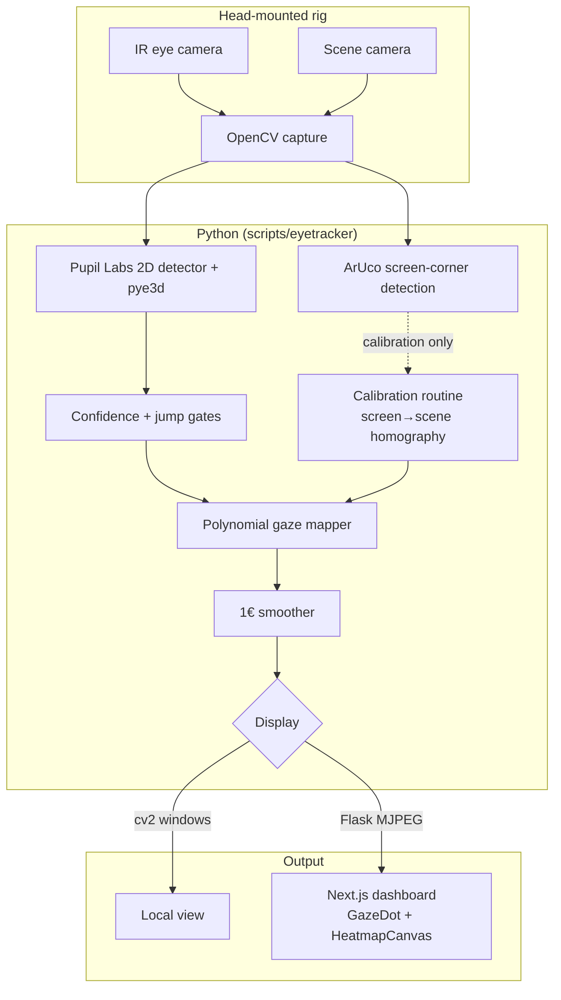

# Eye Tracker

A high-precision, low-latency eye tracker prototype. Eventual use cases include medical, marketing, sports performance coaching, gaming, and day-to-day life.

A head-mounted rig pairs an IR eye camera with a forward-facing scene camera. A Python pipeline detects the pupil, calibrates a polynomial mapping from pupil pixels to scene-camera pixels, and either renders the gaze locally (OpenCV) or streams annotated frames over HTTP for a Next.js dashboard to overlay.

## Running

Backend (eye tracker only):

```
py -m scripts.eyetracker
```

Backend + web frontend (routes camera feeds to HTTP MJPEG endpoints instead of opening cv2 windows):

```
py -m scripts.eyetracker --web
```

Frontend (in a separate terminal):

```
cd frontend
npm run dev
```

Then open the dashboard, log in (or sign up), and click **Load Calibration** to reuse the most recent saved fit.

### In-app controls (eye tracker window)

| Key | Action |
| --- | --- |
| `c` | Quick calibration (4×3 grid, degree-2 polynomial) |
| `d` | Detailed calibration (5×4 grid, degree-3 polynomial, with worst-point recapture) |
| `l` | Load most recent saved calibration |
| `r` | Reset the pye3d 3D pupil model (give it ~30 s to reconverge) |
| `space` | Pause |
| `q` | Quit |

## Repo layout

```
scripts/eyetracker/         # Main Python package — `py -m scripts.eyetracker`
    __main__.py             # Composition root: wires concrete classes into App
    app.py                  # Main loop, frame routing, key dispatch
    config.py               # All tunables (camera, calibration grid, smoother, ArUco)
    cameras/                # OpenCV camera sources + discovery
    pupil/                  # Pupil Labs detector + confidence/jump gates
    scene/                  # ArUco detection and screen→scene homography
    gaze/                   # Polynomial mapper, 1€ smoother
    calibration/            # State machine, sample collector, persistence
    display/                # Tk calibration overlay, cv2 windows, Flask MJPEG server

scripts/extras/             # Standalone utilities
    record.py                       # Sync-recorded eye + scene MP4s
    analyze_recordings.py           # Per-file stats on a recording dir
    calibrate_scene_intrinsics.py   # ChArUco intrinsics for the scene camera
    generate_charuco_board.py       # Prints the board PNG used above
    gaze_emulator.py                # Synthetic gaze stream for frontend dev
    measure_gaze_accuracy.py        # Post-hoc accuracy on a labeled session
    heatmap.py, camera_test.py, linux_cam_stream.py

frontend/                   # Next.js 16 / React 19 dashboard (Supabase auth)
    app/                    # App-router pages
        dashboard/          # calibration, games, heatmap, ml-analytics, profile
        login/, signup/
    components/             # GazeDot, HeatmapCanvas
    lib/supabase.ts

docs/                       # Implementation notes, citations, architecture
    polynomial_gaze_mapping.md      # How the pupil→scene fit works end-to-end
    data_collection.md              # Fields the data-collection pipeline captures
    citations/                      # references.bib + references.tex
    architecture/workspace.dsl      # Structurizr C4 model (C1 / C2 / C3)

data/                       # Recorded MP4s + per-session calibration dumps
3d-files/                   # STLs for the headset mounts and calibration jig
requirements.txt            # Python deps (Flask, OpenCV, numpy, pupil-detectors)
```

## Pipeline (current, as built)


```mermaid
graph TD
    subgraph Hardware ["Head-mounted rig"]
        EYE[IR eye camera] --> CAP[OpenCV capture]
        SCN[Scene camera] --> CAP
    end

    subgraph Backend ["Python (scripts/eyetracker)"]
        CAP --> PD[Pupil Labs 2D detector + pye3d]
        PD --> GATE[Confidence + jump gates]
        GATE --> POLY[Polynomial gaze mapper]
        CAP --> ARUCO[ArUco screen-corner detection]
        ARUCO -. calibration only .-> CAL[Calibration routine<br/>screen→scene homography]
        CAL --> POLY
        POLY --> SMOOTH[1€ smoother]
        SMOOTH --> OUT{Display}
    end

    subgraph Output
        OUT -->|cv2 windows| CV[Local view]
        OUT -->|Flask MJPEG| WEB[Next.js dashboard<br/>GazeDot + HeatmapCanvas]
    end
```

See [`docs/polynomial_gaze_mapping.md`](docs/polynomial_gaze_mapping.md) for the math behind the pupil→scene fit and why the homography only shows up during calibration.

## Code style

- **Python** — [PEP 8](https://peps.python.org/pep-0008/). Enforced by `flake8` in CI (`.github/workflows/linter.yml`): blocking on `E9`/`F63`/`F7`/`F82` (syntax errors, undefined names), with line length 127 and McCabe complexity 10 as non-blocking warnings. Public-facing modules, classes, and functions carry docstrings.
- **TypeScript / React** — Next.js ESLint preset (`eslint-config-next/core-web-vitals` + `eslint-config-next/typescript`), configured in `frontend/eslint.config.mjs`. `frontend/tsconfig.json` enables `strict: true`. Exported React components carry JSDoc.

External references the project relies on are catalogued in [`docs/citations/references.bib`](docs/citations/references.bib); the system architecture lives in [`docs/architecture/workspace.dsl`](docs/architecture/workspace.dsl) (Structurizr DSL, renders at <https://structurizr.com/dsl>).

## Roadmap


- [x] Physical prototype with model-based eye tracking, processing on a laptop/PC, data streaming to the terminal.
- [x] Web dashboard for visualizing live gaze.
- [x] Real-time heatmap overlay for analyzing session patterns.

Beyond this course:
- [ ] Data-collection pipeline for ground-truth gaze datasets (see `docs/data_collection.md`).
- [ ] 3D model-based pipeline (calibration jig for extrinsics; principled eye-model fit).
- [ ] Learned (CNN) gaze estimation trained on the collected data.
- [ ] Mobile setup: Jetson Nano streaming over Wi-Fi to a laptop.
- [ ] Fully embedded: AI inference on a Jetson Nano, data streaming to the web app over Wi-Fi.

## Team

Cody Lam, Daniel Kaijzer, Ethan Shim, Harwin He, Roselio Ortega

[Project slide updates](https://drive.google.com/drive/folders/1MlPhl_qL4AJbGT0cuVbFjbPvMYAlWQSm?usp=sharing)
