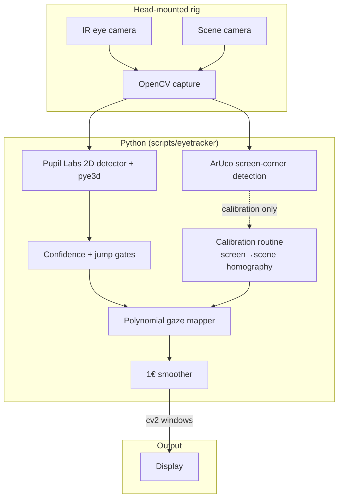

# Eye Tracker

A low-cost, high-precision, low-latency eye tracker prototype. A head-mounted rig pairs an IR eye camera with a forward-facing scene camera. A Python pipeline detects the pupil, calibrates a polynomial mapping from pupil pixels to scene-camera pixels, and renders the gaze locally (OpenCV).

## Platforms

- **Linux (Jetson Orin) is the research rig.** Data collection, time-synced capture and anything that depends on precise timing runs here, and it's the platform the code is developed and tested against.
- **macOS is a live-demo mode.** Plug the headset into a Mac for a quick calibration and live gaze, with no Jetson or external monitor needed. Research features may be missing or degraded there, and CI doesn't cover it, so run a quick calibration before any demo.

## Install

**Linux** (research rig; tested on Jetson Orin, JetPack 6 / Ubuntu 22.04, Python 3.10):

```
sudo apt install libeigen3-dev libopencv-dev cmake python3-dev python3-venv v4l-utils
git clone https://github.com/pupil-labs/pupil-detectors.git ../pupil-detectors
conda create -n et python=3.10 && conda activate et   # or a plain venv
pip install -r requirements.txt                 # builds pupil-detectors + pye3d from source
pip uninstall -y opencv-python                  # pupil-detectors pulls it in; it shadows opencv-contrib-python
pip install --force-reinstall --no-deps opencv-contrib-python==4.13.0.92
```

Your user must be in the `video` group to open `/dev/video*`. Cameras are opened through V4L2 with MJPG. The scene cam is picked by its USB id (`SCENE_UVC_ID` in `config.py`) because each UVC camera shows up as two `/dev/video` nodes. Exposure hotkeys go through `v4l2-ctl`. When launching over SSH, target the attached monitor with `DISPLAY=:0`.

**macOS** (demo mode):

```
brew install eigen opencv                       # system deps for pupil-detectors
git clone https://github.com/pupil-labs/pupil-detectors.git ../pupil-detectors
pip install -r requirements.txt                 # installs the local pupil-detectors clone
```

Optional: scene-cam exposure hotkeys need the `uvc-util` binary (build steps in `requirements.txt`; terminal usage in `docs/uvc_exposure_cheatsheet.md`). Without it the app runs with the camera's default exposure.

**Both:** if the pupil-detectors build fails with `FindCython ... cython;--version failed`, CMake cached a temp build-env path from an earlier failed attempt. Delete `../pupil-detectors/_skbuild` and retry. If it still fails, install the build deps (`pip install setuptools_scm scikit-build cmake ninja cython`) and use `pip install --no-build-isolation ../pupil-detectors`.

`requirements.txt` references `../pupil-detectors` as a local path relative to the repo root; adjust the clone location or edit the path if your layout differs. `pye3d` ships from PyPI (built from source on aarch64).

**Hardware** — head-mounted rig with an IR eye camera and a forward-facing scene camera (USB UVC). Calibration draws four ArUco markers (`DICT_4X4_50`, IDs 0/1/2/3) directly onto the calibration screen.

## Running

```
DISPLAY=:0 python -m scripts.eyetracker         # Linux, in the `et` env (DISPLAY only needed over SSH)
python -m scripts.eyetracker                    # macOS demo
```

### In-app controls (eye tracker window)

| Key | Action |
| --- | --- |
| `c` | Quick calibration (3×3 grid, degree-2 polynomial). During calibration: capture the current point, or start the next pose |
| `d` | Detailed calibration (5×4 grid, degree-3 polynomial, with worst-point recapture) |
| `m` | Multi-pose calibration (one grid per head pose, aggregated into one fit — widens field-of-view coverage; press `c` to start each pose) |
| `v` | Validation capture (collect-only; writes a held-out session tagged `phase: validation` for accuracy measurement, leaves the live calibration untouched) |
| `l` | Load most recent saved calibration |
| `r` | Reset the pye3d 3D pupil model (give it ~30 s to reconverge) |
| `s` / `Esc` | During calibration: skip the current point / abort its capture and retry |
| `p`, `-` / `=` | During calibration: camera preview, marker brightness |
| `[` / `]`, `{` / `}` | Scene exposure darker / brighter, fine / coarse |
| `space` | Pause |
| `q` | Quit |

For why `m` and `v` exist and how to read the accuracy numbers, see
[`docs/calibration_coverage.md`](docs/calibration_coverage.md) and
[`docs/multipose_calibration.md`](docs/multipose_calibration.md).

## Repo layout

```
scripts/eyetracker/         # Main Python package — `python -m scripts.eyetracker`
    __main__.py             # Composition root: wires concrete classes into App
    app.py                  # Main loop, frame routing, key dispatch
    config.py               # All tunables (camera, calibration grid, smoother, ArUco)
    cameras/                # OpenCV camera sources + discovery
    pupil/                  # Pupil Labs detector + confidence/jump gates
    scene/                  # ArUco detection and screen→scene homography
    gaze/                   # Polynomial mapper, 1€ smoother
    calibration/            # State machine, sample collector, persistence
    dataset.py              # Read recorded sessions (metadata.json + labels.csv)
    display/                # Tk calibration overlay, cv2 windows

scripts/extras/             # Standalone utilities
    calibrate_scene_intrinsics.py   # ChArUco intrinsics for the scene camera
    generate_charuco_board.py       # Screen board PNG for the above; printable jig boards (PDF)
    charuco_boards.py               # Board specs shared by the generator and calibration scripts
    measure_gaze_accuracy.py        # Accuracy binned by eccentricity; held-out validation sessions

docs/                       # Implementation notes, citations, architecture
    polynomial_gaze_mapping.md      # How the pupil→scene fit works end-to-end
    loo_error_notes.md              # Leave-one-out error: what it measures, past regression
    calibration_coverage.md         # The coverage problem + eccentricity validation tooling
    multipose_calibration.md        # Multi-pose calibration: widening FOV coverage
    uvc_exposure_cheatsheet.md      # macOS uvc-util camera controls from the terminal
    data_collection.md              # Fields the data-collection pipeline captures
    dataset_format.md               # On-disk format for sessions + calibration artifacts
    citations/                      # references.bib + references.tex

data/                       # Recorded calibration sessions (gitignored)
3d-files/                   # OpenSCAD camera mounts (see its README)
requirements.txt            # Python deps (OpenCV, numpy, pupil-detectors)
```

## Pipeline


```mermaid
graph TD
    subgraph Hardware ["Head-mounted rig"]
        EYE[IR eye camera] --> CAP[OpenCV capture]
        SCN[Scene camera] --> CAP
    end

    subgraph Pipeline ["Python (scripts/eyetracker)"]
        CAP --> PD[Pupil Labs 2D detector + pye3d]
        PD --> GATE[Confidence + jump gates]
        GATE --> POLY[Polynomial gaze mapper]
        CAP --> ARUCO[ArUco screen-corner detection]
        ARUCO -. calibration only .-> CAL[Calibration routine<br/>screen→scene homography]
        CAL --> POLY
        POLY --> SMOOTH[1€ smoother]
    end

    subgraph Output
        SMOOTH -->|cv2 windows| CV[Display]
    end
```

See [`docs/polynomial_gaze_mapping.md`](docs/polynomial_gaze_mapping.md) for the math behind the pupil→scene fit and why the homography only shows up during calibration.

## Code style

- **Python** — [PEP 8](https://peps.python.org/pep-0008/). Enforced by `flake8` in CI (`.github/workflows/linter.yml`): blocking on `E9`/`F63`/`F7`/`F82` (syntax errors, undefined names), with line length 127 and McCabe complexity 10 as non-blocking warnings. Public-facing modules, classes, and functions carry docstrings.

## Design & architecture

- **External references** — catalogued in [`docs/citations/references.bib`](docs/citations/references.bib)

## Maintainer 

Daniel Kaijzer

## Prior contributors

Cody Lam, Ethan Shim, Harwin He, Roselio Ortega
